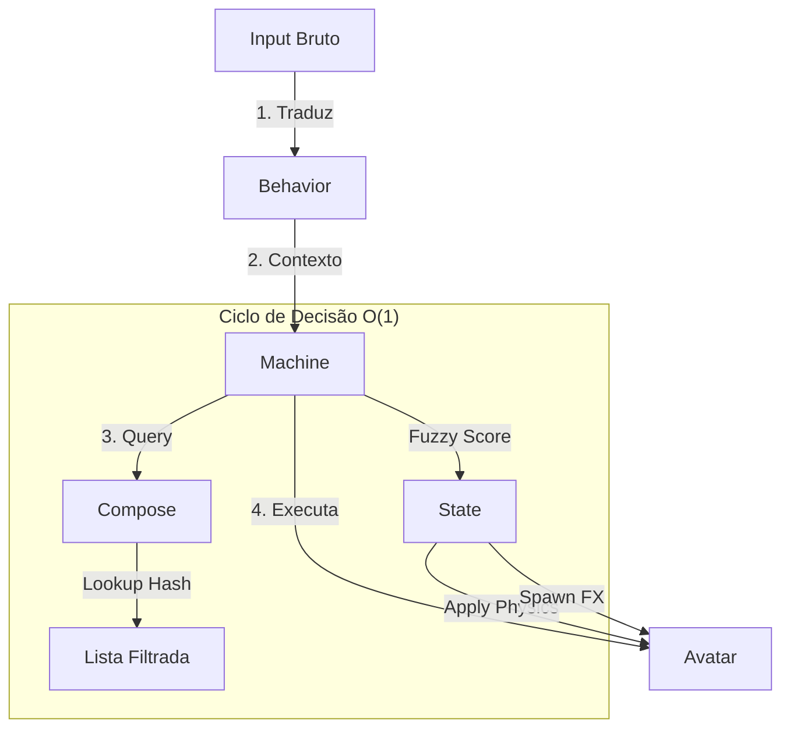

# Godot MBA: O Grimório do Arquiteto

> **Contexto:** Este documento é a "Bíblia" técnica para o desenvolvimento do curso **Godot MBA**. Ele define os pilares da nossa arquitetura e serve como referência absoluta para Agentes de IA e Alunos.

---

## 1. Paradigmas de Desenvolvimento

Para construir sistemas complexos, precisamos entender as ferramentas conceituais à nossa disposição.

### 1.1. Orientação a Objetos (OOP)

**"O Comportamento define o Objeto."**

Na OOP clássica, focamos em **Classes** que encapsulam dados e métodos.

- **Herança:** "Um `Guerreiro` **é um** `Personagem`".
- **Encapsulamento:** O `Guerreiro` protege sua vida (`private health`) e oferece métodos (`take_damage()`).
- **Polimorfismo:** Tratamos `Guerreiro` e `Mago` como `Personagem`, chamando `atacar()` sem saber qual classe específica é.

**Na Godot:**

- Todo Node (`CharacterBody2D`, `Sprite2D`) é um Objeto.
- Scripts `.gd` são Classes.
- Usamos OOP para a **Lógica de Controle** (Controllers, Managers, Machines).

### 1.2. Orientação a Dados (DOP)

**"A Memória define a Performance."**

Na DOP, focamos em como os dados são organizados na memória para otimizar o acesso da CPU (Cache Locality).

- **ECS (Entity Component System):** Separação total entre Dados (Componentes) e Lógica (Sistemas).

**Na Godot:**

- Usamos `Servers` (`PhysicsServer2D`, `RenderingServer`) para alta performance.
- Usamos `PackedFloat32Array` para grandes volumes de dados numéricos.

### 1.3. Orientação a Resources (ROP)

**"O Machi Way: Onde Dados viram Comportamento."**

O **Resource-Oriented Programming (ROP)** é o "pulo do gato" da Godot. É um híbrido poderoso entre OOP e DOP.

- **Definição:** Resources são objetos de dados serializáveis (`.tres`) que podem conter lógica pura (helper functions).
- **Compartilhamento:** Se 1000 Goblins usam o mesmo `goblin_stats.tres`, eles compartilham a mesma instância na memória RAM.
- **Injeção:** Nodes (Comportamento) recebem Resources (Configuração) para saber o que fazer.

---

## 2. Fundamentos da Godot

### 2.1. Herança e `extends`

Em GDScript, a herança é a base da reutilização de código de _comportamento_.

```gdscript
# entity.gd
class_name Entity extends CharacterBody2D

func take_damage(amount: int):
    print("Entity took damage")

# player.gd
class_name Player extends Entity

func take_damage(amount: int):
    super(amount)
    HUD.shake_screen()
```

### 2.2. Autoloads (Singletons)

São Nodes que a Godot carrega automaticamente na raiz (`/root/`).

**Quando usar:**

- Gerenciadores Globais (`SoundManager`, `SaveSystem`, `GameSettings`).
- Dados de Sessão (`SessionData`).
- Vocabulários Globais (`BehaviorStates.gd`).

**Quando NÃO usar:**

- Para passar dados entre Player e Inimigo (Use Sinais ou Resources).
- Para lógica de gameplay específica de uma cena.

---

## 3. O Framework: BehaviorStates

O **BehaviorStates** é a infraestrutura proprietária do Machi para criar Sistemas de Comportamento Reativos e Orientados a Dados. Ele substitui Máquinas de Estado Finitas (FSM) por **Sistemas de Query Contextual**.

### 3.1. Arquitetura do Framework

```text
addons/behavior_states/
├── assets/                  # Ícones e Temas
├── nodes/                   # Nodes de Runtime
│   ├── behavior.gd          # O Orquestrador
│   ├── machine.gd           # A Engine
│   ├── backpack.gd          # HUD de Inventário
│   └── slot.gd              # Slot individual
├── resources/               # O DNA
│   ├── state.gd             # Unidade atômica
│   ├── compose.gd           # Aglomerador de States
│   ├── item.gd              # Itens e Armas
│   ├── skill.gd             # Habilidades
│   ├── skilltree.gd         # Grafo de progressão
│   ├── effects.gd           # Modificadores
│   ├── inventory.gd         # Container de itens (Vivo)
│   ├── character_sheet.gd   # Ficha do personagem (Vivo)
│   ├── config.gd            # Configuração global
│   └── blocks/              # Blocos visuais do Editor
└── scenes/                  # UI do Editor
    ├── panel.tscn           # Bottom Panel
    └── tabs/                # Abas (Library, Editor, Factory, Grimório)
```

### 3.2. Fluxo de Execução



### 3.3. Os Componentes (Passo a Passo)

#### 1. Criar os States

No FileSystem ou via **Factory**, crie arquivos `.tres`:

- `Slash_Light.tres` (Attack State)
- `Run_Fast.tres` (Move State)

No Inspector (ou **Editor** do painel), defina os **Requisitos**:

- `entry_requirements: { "motion": RUN, "weapon": KATANA }`

#### 2. Criar os Composes

Agrupe os States em "Decks". Ex: `Katana_Moveset.tres`.
O sistema indexará automaticamente (`@tool`) para lookups O(1).

#### 3. Configurar o Personagem

Adicione os Nodes `Behavior`, `Machine` e `Backpack` ao personagem.

#### 4. O Código do Personagem (Semântico)

O `Player.gd` apenas comunica **intenção**:

```gdscript
func _physics_process(delta):
    if Input.is_action_pressed("fire"):
        behavior.set_context("Attack", BehaviorStates.Attack.NORMAL)
    # A Machine resolve O QUE fazer baseado no Item equipado
```

### 3.4. Diferenciais BehaviorStates

1. **Workbench Integrada:** IDE completa dentro da Godot com Library, Editor Blueprint, Factory e Grimório.
2. **VM vs Hardcode:** A `Machine` é uma Virtual Machine. O Resource dita a instrução, a Machine executa.
3. **Recursos Vivos:** `Inventory` e `CharacterSheet` são editáveis in-game e persistem entre sessões.
4. **Blocos Visuais:** FilterBlock, ActionBlock, TriggerBlock para States. RequirementBlock, UnlockBlock para Skills.

### 3.5. Otimização O(1) (HashMap)

Para evitar loops lineares (`O(N)`) a cada frame, usamos **Indexação Invertida**:

1. **Index Time:** O `Compose` cria buckets: `Attack = [Slash1, Slash2]`.
2. **Query Time:** A Machine acessa `compose.attack_rules[Attack]` diretamente.
3. **Resultado:** Busca constante, independente de ter 10 ou 1000 habilidades.

---

## 4. Mapa do Conhecimento (Índice de Arquivos)

Para onde ir se você quiser aprender sobre...

### Framework Visionário

- **`README.md`**: A Fonte da Verdade. Visão, Arquitetura e Referência Técnica unificadas.
- **`EMENTA.md`**: Documentação completa de todos os Resources, Nodes e Tabs do Editor.

### Fundamentos

- **`01_GodotFundamentals.md`**: Tipagem, Sinais e Ciclo de Vida.
- **`03_Singletons.md`**: Quando usar (e não usar) Autoloads.

### ROP e Arquitetura

- **`02_ResourceOrientedProgramming.md`**: A fundação de dados vs lógica.
- **`05_StateMachines.md`**: Da FSM clássica ao BehaviorStates.

### Avançado

- **`14_GDExtensions.md`**: Performance com C++/Rust.

---

Este é o seu arsenal. Use-o para construir não apenas jogos, mas sistemas de engenharia robustos e belos.
**Machi out.**
