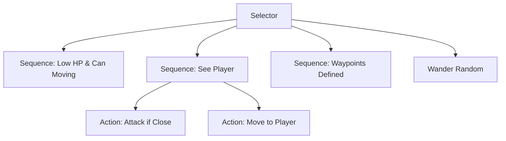

# Bestiário: Inimigos e Bosses

Todos os inimigos utilizam o **Behavior Tree Plugin** para IA e **Synapse** para percepção.

## 🟢 Inimigos Comuns

### 1. Slime Corrompido

_O lixo tóxico da floresta._

- **HP:** 30 | **Dano:** 5 (Contato).
- **Comportamento:**
  - **Passivo:** Vagueia aleatoriamente (`Wander`).
  - **Agressivo:** Se vê o player (`VisualSensor`), persegue em linha reta.
  - **Especial:** Ao morrer, divide-se em 2 "Mini-Slimes" com 10 HP cada.

### 2. Lobo das Sombras (Shadow Stalker)

_Predador noturno._

- **HP:** 60 | **Dano:** 12 (Mordida).
- **Spawn:** Apenas à noite (controlado pelo `Gaia`).
- **Comportamento:**
  - **Furtivo:** Tenta flanquear o jogador (ir para as costas).
  - **Medo de Luz:** Se o jogador usar um Frasco de Fogo ou estiver perto de uma tocha, o Lobo recua (`Flee`).

### 3. Golem Guardião

_Sentinela das ruínas antigas._

- **HP:** 150 | **Dano:** 25 (Pancada).
- **Comportamento:**
  - **Lento:** Move-se muito devagar.
  - **Block:** Pode entrar em estado de defesa (imune a dano frontal) por 3s.
  - **Telegraph:** Levanta os braços 1s antes de atacar. O jogador deve esquivar.

---

## 💀 Chefes (Bosses)

### O Ent Corrompido (The Corrupted Treant)

_Mestre Orion fundido à natureza morta._

**Local:** Profundezas das Ruínas.
**Fases:** Controladas pelo `Director` (Sequencer).

#### Fase 1: Enraizado (100% - 50% HP)

- O Chefe está fixo no centro.
- **Ataque A:** Batida de Raiz (Linhas de dano no chão).
- **Ataque B:** Cuspidor de Veneno (Projéteis teleguiados).

#### Cutscene de Transição (50% HP)

- O Ent arranca suas raízes do chão e começa a andar. A música fica mais rápida.

#### Fase 2: Fúria (50% - 0% HP)

- O Chefe persegue o player.
- **Ataque C:** Investida (Charge) que atordoa se acertar a parede. (O jogador deve fazê-lo bater na parede para dar dano extra).
- **Summon:** Invoca 4 Slimes para atrapalhar.

## 🧠 Árvore de Comportamento Padrão (Template)

